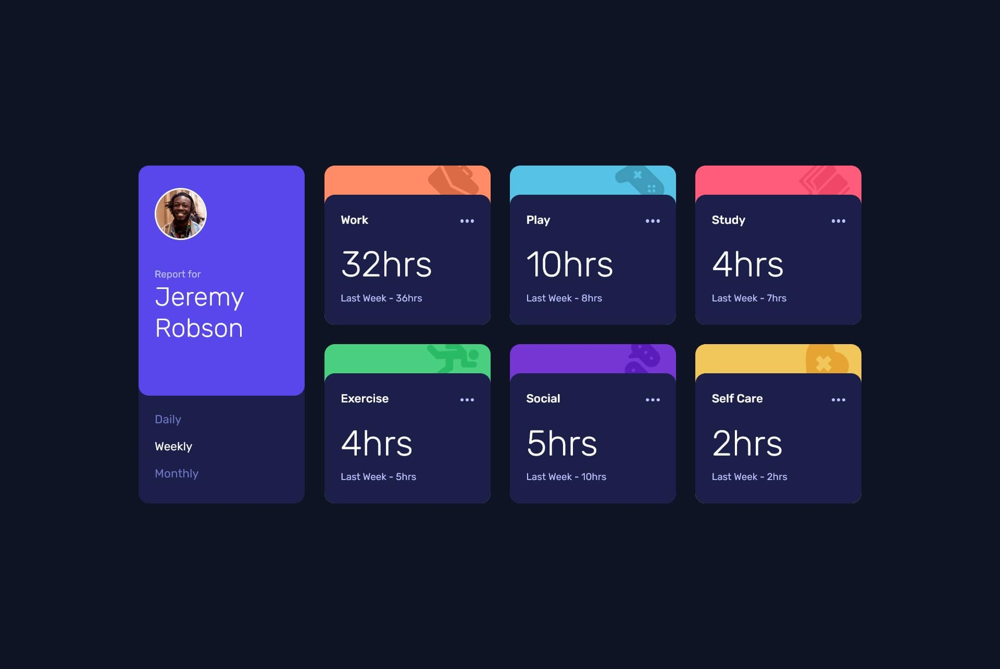

# Frontend Mentor - Time tracking dashboard solution

This is a solution to the [Time tracking dashboard challenge on Frontend Mentor](https://www.frontendmentor.io/challenges/time-tracking-dashboard-UIQ7167Jw). Frontend Mentor challenges help you improve your coding skills by building realistic projects. 

## Table of contents

- [Overview](#overview)
  - [The challenge](#the-challenge)
  - [Screenshot](#screenshot)
  - [Links](#links)
- [My process](#my-process)
  - [Built with](#built-with)
  - [What I learned](#what-i-learned)

## Overview

### The challenge

Users should be able to:

- View the optimal layout for the site depending on their device's screen size
- See hover states for all interactive elements on the page
- Switch between viewing Daily, Weekly, and Monthly stats

### Screenshot



### Links

- Solution URL: [Time Tracking Dashboard Solution](https://github.com/telsabate-hub/time-tracking-dashboard)
- Live Site URL: [Time Tracking Dashboard Page](https://telsabate-hub.github.io/time-tracking-dashboard/)

## My process

### Built with

- Semantic HTML5 markup
- CSS custom properties
- Flexbox
- CSS Grid
- SASS/SCSS
- JavaScript

### What I learned

I learned about the Fetch API and here's how I used it in this project:

```js
fetch('./data.json').then((response) => {  
    if(!response.ok) return console.log('Oops! Something went wrong.');

    return response.json();
}).then((data) => {
    timeframeData = data;

    setTimeframes();
});
```

